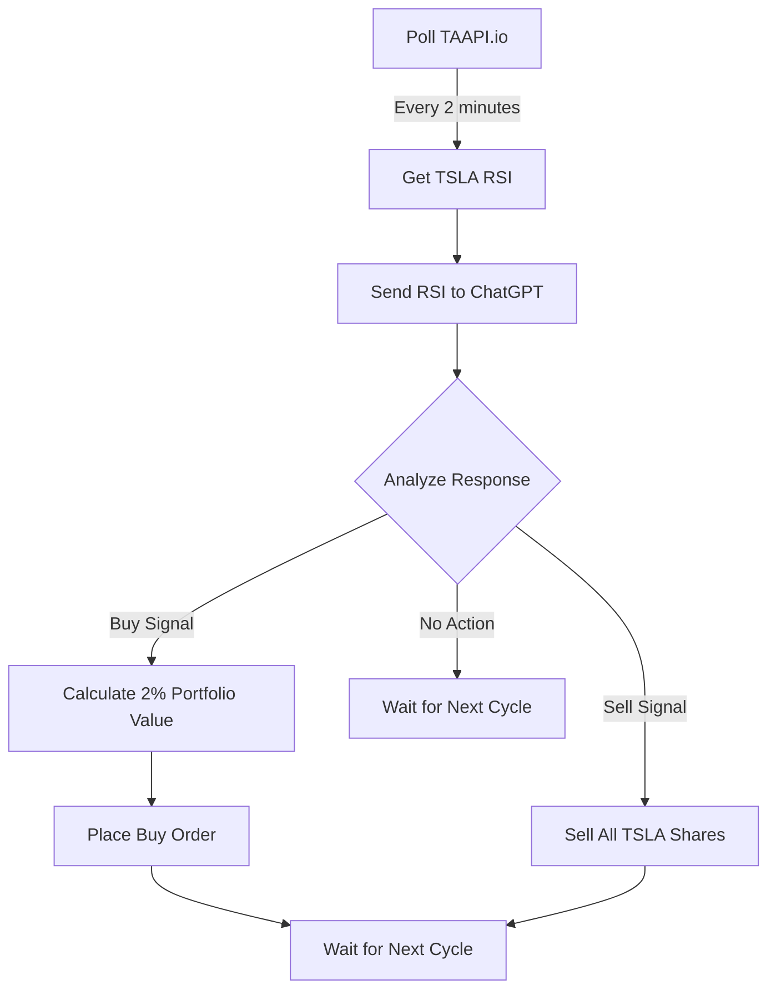

# 🤖 RSI-Based TSLA Trading Bot

An automated trading bot that leverages RSI (Relative Strength Index) and ChatGPT's AI capabilities to make data-driven trading decisions for Tesla (TSLA) stock.

## 🔄 How It Works



## 🔑 Prerequisites

You'll need API keys from:
- [TAAPI.io](https://taapi.io/) - For real-time RSI data
- [OpenAI](https://platform.openai.com/) - For ChatGPT trading analysis
- [Alpaca](https://alpaca.markets/) - For executing trades (paper trading recommended)

## 🚀 Setup

1. Clone this repository
2. Install required packages:
   ```bash
   pip install -r requirements.txt
   ```
3. Set up environment variables:
   ```bash
   cp .env.example .env
   # Edit .env and add your API keys
   ```

## 💫 Features

- **Real-time Monitoring**: Polls TSLA's RSI every 2 minutes
- **AI-Powered Decisions**: Uses ChatGPT to analyze RSI data
- **Risk Management**: 
  - Uses only 2% of portfolio per buy order
  - Full position liquidation on sell signals
  - Paper trading support for safe testing

## 🔧 Usage

Start the trading bot:
```bash
python trading_bot.py
```

## ⚠️ Disclaimer

This is a demonstration bot for educational purposes. Always:
- Use paper trading for initial testing
- Understand the risks involved in automated trading
- Monitor the bot's performance regularly
- Never trade with money you can't afford to lose